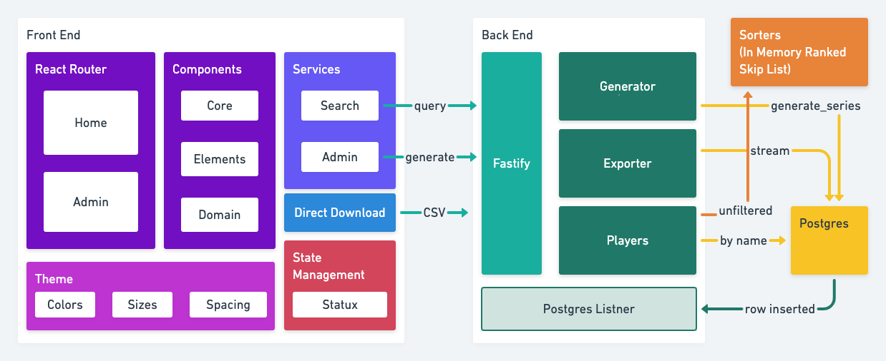
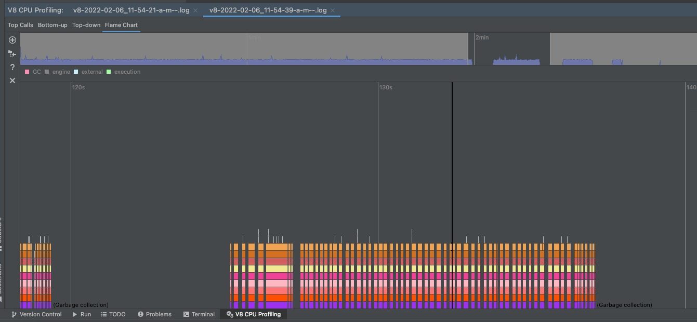

### Challenge Background
We have sets of records representing football players' rushing statistics. All records have the following attributes:
* `Player` (Player's name)
* `Team` (Player's team abbreviation)
* `Pos` (Player's postion)
* `Att/G` (Rushing Attempts Per Game Average)
* `Att` (Rushing Attempts)
* `Yds` (Total Rushing Yards)
* `Avg` (Rushing Average Yards Per Attempt)
* `Yds/G` (Rushing Yards Per Game)
* `TD` (Total Rushing Touchdowns)
* `Lng` (Longest Rush -- a `T` represents a touchdown occurred)
* `1st` (Rushing First Downs)
* `1st%` (Rushing First Down Percentage)
* `20+` (Rushing 20+ Yards Each)
* `40+` (Rushing 40+ Yards Each)
* `FUM` (Rushing Fumbles)

### Installation and running this solution

```shell
# step 1 - navigate to the server folder
cd ./server

# step 2 - build docker image
docker build -t nfl:latest .

# step 3 - run containers
docker-compose -p "nfl" up
```

The app container exposes port 9000 and if nothing went wrong you should see
a leaderboard populate with the players from the json file by navigating to http://localhost:9000.

https://user-images.githubusercontent.com/654727/156025299-2c50b34f-008f-46a4-b1e4-a6f92a6d0924.mp4

### Design



#### Frontend
React is used with React Router to route between the Home and Admin pages. Components
are divided into:
 - `Core`, generic components
 - `Elements`, a composition of one or more core components
 - `Domain` a composition of one or many core or elements specific to the domain and also handling business logic.
 
It was my first time using Statux for state management which I decided to try for its simple API.

#### Backend

Fastify is used for the web server and each route is configured to call the appropriate controller. For storage, Postgres is used and a listner is initialized 
at startup time to receive every new player that is inserted. 

To make the exercise more fun, I decided to support pagination for millions of ranked players. This use case is
challenging for a relational database because using `offset` requires to query all the rows first and then skip the offset.
Inspired by Redis' Sorted Sets, which implements a skip list under the hood, I implemented my own toy skip list as a learning exercise.
The initial loading of the skip list for millions of players takes some time but applying pagination on the leaderboard is extremely quick.

There are many strategies for filtering by the player's name:
- exact match
- prefix only (`%name`)
- full-text match (`%name%`)

I decided to go with full-text because it offers the best UX. I used a trigram index to speed up the search with the trade-off of using a lot more space and returning a max number of players.

#### Limitations

1. Ties are not handled because a skip list implementation is optimized to skip forward by count.

2. A maximum of 1000 players are returned when filtering by player's name. Since the resulting list requires a new skip list, which could potentially be expensive depending on the size, the strategy is to fallback using `OFFSET` but limit the result.

#### Quick and dirty benchmarking

We can see using `offset` does not scale well as the number of rows to offset increases. 

```sql
nfl=# select id, player, att from leaderboard order by att desc offset 0 limit 10;
   id   |   player   | att
--------+------------+------
 656972 | 02ff94fabe | 1000
 666796 | 8f9cba747b | 1000
 648013 | 09b76e7176 | 1000
 655016 | 6134d8bf7f | 1000
 657897 | 5e0d0eb78b | 1000
 660294 | 32d4a98f2b | 1000
 644558 | f65ff7b5f2 | 1000
 647765 | f95c94152f | 1000
 647267 | ba032b0f24 | 1000
 666889 | c5f616e17e | 1000
(10 rows)

Time: 714.633 ms

nfl=# select id, player, att from leaderboard order by att desc offset 10000 limit 10;
   id    |   player   | att
---------+------------+-----
  135130 | 8fe8776d65 | 999
 5372694 | a183e12bce | 999
 5113377 | f2e5014812 | 999
 5281757 | 5f41b0ed2f | 999
  134860 | 5337c7a970 | 999
  135316 | 2148e75296 | 999
 1629177 | 40342c8eb4 | 999
  847434 | 35e45eff1e | 999
 3055836 | 8a576c44f9 | 999
 8302825 | a24598c121 | 999
(10 rows)

Time: 750.192 ms

nfl=# select id, player, att from leaderboard order by att desc offset 100000 limit 10;
   id    |   player   | att
---------+------------+-----
 3924452 | 4f0be04253 | 990
 3905745 | 7caeb0f36c | 990
 3907195 | 1cf48b3297 | 990
 3917098 | b8717631f9 | 990
 3011952 | 1f1f4df338 | 990
 2960379 | c46b1f4588 | 990
 2957472 | 62c6c8adf0 | 990
 2989978 | 3ce151b8ac | 990
 2957930 | b70c3c610e | 990
 2957371 | b749eccbd5 | 990
(10 rows)

Time: 2058.782 ms (00:02.059)

nfl=# select id, player, att from leaderboard order by att desc offset 1000000 limit 10;
   id    |   player   | att
---------+------------+-----
 6494120 | 3271b37ae3 | 900
 6466088 | 0e54b12aaa | 900
 6484361 | 033613ea5c | 900
 6487321 | f62bd7ba2d | 900
 6496999 | 989f136bcc | 900
 6476308 | a7c92de61a | 900
 6382574 | 2154794e5a | 900
 6488539 | e1bd2f3354 | 900
 6480932 | 05cfadbb01 | 900
 6481317 | a8c0870d7c | 900
(10 rows)

Time: 2219.489 ms (00:02.219)


Time: 3400.190 ms (00:03.400)
nfl=# select id, player, att from leaderboard order by att desc offset 9900000 limit 10;
   id    |   player   | att
---------+------------+-----
 4668344 | 54ec27c47d |  10
 4606772 | 312b414e8d |  10
 4670145 | 7c4e4e2ae6 |  10
 4691762 | 50e3e2286a |  10
 4607641 | a3d46b87ad |  10
 4602370 | 6aca78e79b |  10
 4658428 | c63827826c |  10
 4603188 | 5b2ea59482 |  10
 4602392 | 61dfb1b631 |  10
 4666299 | 421e3df592 |  10
(10 rows)

Time: 3602.042 ms (00:03.602)
```

Here we can see it needs to do a sequential scan.

```sql
nfl=# explain analyze select id, player, att from leaderboard order by att desc offset 9900000 limit 10;
                                                                      QUERY PLAN
-------------------------------------------------------------------------------------------------------------------------------------------------------
 Limit  (cost=1777338.11..1777338.23 rows=1 width=19) (actual time=212494.838..212527.084 rows=10 loops=1)
   ->  Gather Merge  (cost=805043.03..1777338.11 rows=8333376 width=19) (actual time=43244.786..151374.070 rows=9900010 loops=1)
         Workers Planned: 2
         Workers Launched: 2
         ->  Sort  (cost=804043.00..814459.72 rows=4166688 width=19) (actual time=43218.492..64534.104 rows=3300741 loops=3)
               Sort Key: att DESC
               Sort Method: external merge  Disk: 97848kB
               Worker 0:  Sort Method: external merge  Disk: 97944kB
               Worker 1:  Sort Method: external merge  Disk: 97816kB
               ->  Parallel Seq Scan on leaderboard  (cost=0.00..175000.88 rows=4166688 width=19) (actual time=36.786..21058.091 rows=3333333 loops=3)
 Planning Time: 0.069 ms
 JIT:
   Functions: 8
   Options: Inlining true, Optimization true, Expressions true, Deforming true
   Timing: Generation 1.294 ms, Inlining 85.279 ms, Optimization 27.621 ms, Emission 18.157 ms, Total 132.351 ms
 Execution Time: 212551.087 ms
```

With the current implementation, inserting 30 million players into a skip list is not very effective but querying ranges is. 
```shell
Insert - Execution time: 77466ms
Insert - Execution time (hr): 77s 464.585254ms
Range (100 - 120) - Execution time: 0ms
Range (100 - 120) - Execution time (hr): 0s 0.142956ms
Range (100 - 120) - Execution time: 0ms
Range (100 - 120) - Execution time (hr): 0s 0.022582ms
Range (100 - 120) - Execution time: 0ms
Range (100 - 120) - Execution time (hr): 0s 0.01179ms
Range (100_000 - 100_020) - Execution time: 0ms
Range (100_000 - 100_020) -Execution time (hr): 0s 0.025452ms
Range (100_000 - 100_020) - Execution time: 0ms
Range (100_000 - 100_020) -Execution time (hr): 0s 0.012066ms
Range (100_000 - 100_020) - Execution time: 0ms
Range (100_000 - 100_020) -Execution time (hr): 0s 0.01155ms
Range (1_000_000 - 1_000_020) - Execution time: 0ms
Range (1_000_000 - 1_000_020) - Execution time (hr): 0s 0.026753ms
Range (1_000_000 - 1_000_020) - Execution time: 0ms
Range (1_000_000 - 1_000_020) - Execution time (hr): 0s 0.014463ms
Range (1_000_000 - 1_000_020) - Execution time: 0ms
Range (1_000_000 - 1_000_020) - Execution time (hr): 0s 0.113475ms
```

By taking a quick look at what's happening under the hood, we can see eventually the GC becomes 
the bottleneck and creates very long pauses.



By digging deeper, there's probably a lot that could be optimized but since this is a toy project I decided to stop here!